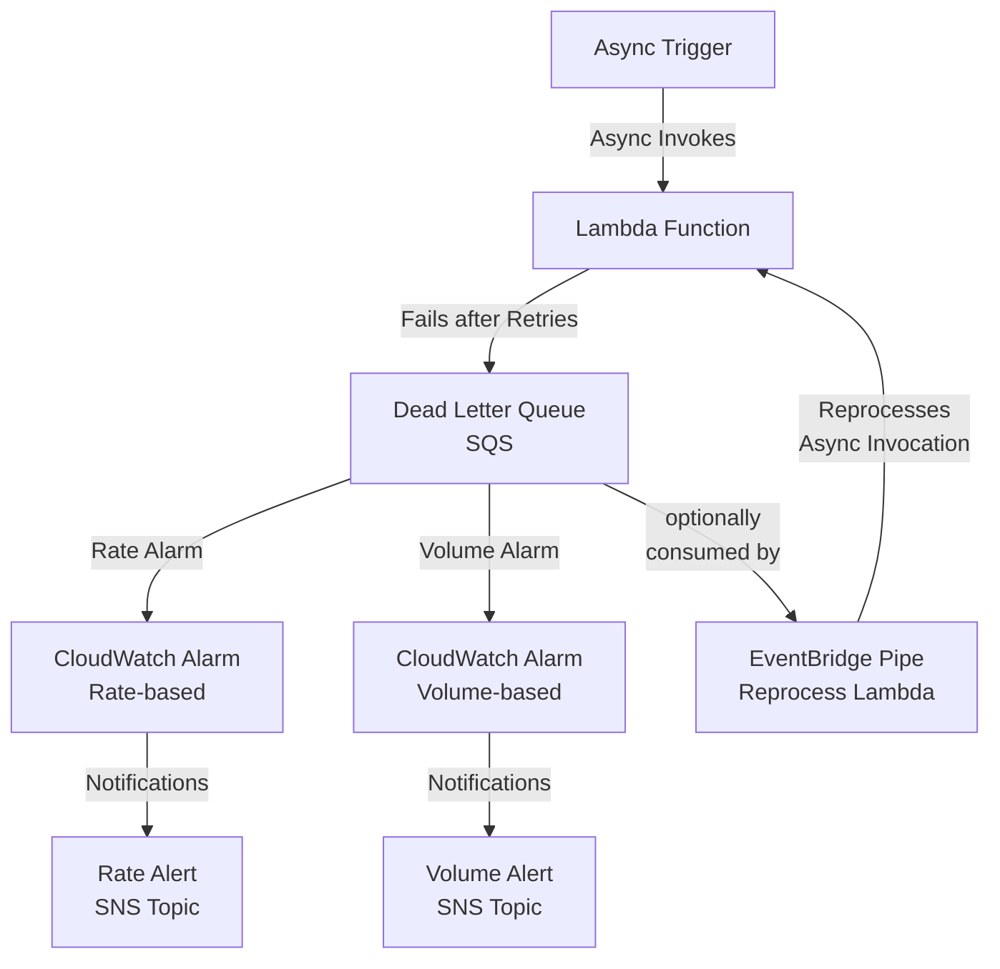

# Terraform AWS Async Lambda Error Notification

This project adds to a given Lambda function notification of async execution error / dead letter queue events.

## Architecture Diagram



## Resources

- **Lambda Function**: Any already existing Lambda function you want to monitor for **async** execution errors.
- **SQS Queue**: Acts as a dead-letter queue for the Lambda function and reprocesses the messages.
- **CloudWatch Alarms**: Alarms when the dead letter queue is growing (Rate-based) or the queue is non-zero (Volume-based).
- **SNS Topics**: Sends notifications when errors occur.
- **EventBridge Pipe**: When MANUALLY turned on, reprocesses events from the dead letter queue to the Lambda function. Defaults to off.

## Variables

### Required Variables

| Name                   | Description                                         |
| ---------------------- | --------------------------------------------------- |
| `lambda_arn`           | The ARN of the Lambda to monitor                    |
| `rate_sns_topic_arn`   | ARN of the SNS topic for rate alarm notifications   |
| `volume_sns_topic_arn` | ARN of the SNS topic for volume alarm notifications |
| `lambda_function_name` | The name of the Lambda function                     |
| `lambda_role_name`     | IAM role name for the Lambda function               |

### Optional Variables

| Name                                               | Description                                                    | Default                |
| -------------------------------------------------- | -------------------------------------------------------------- | ---------------------- |
| `alarms_period`                                    | Period in seconds for CloudWatch alarms                        | `60`                   |
| `alarms_datapoints_to_alarm`                       | Number of data points that must breach to trigger the alarm    | `2`                    |
| `alarms_evaluation_periods`                        | Number of periods over which data is compared                  | `2`                    |
| `eventbridge_pipe_name`                            | Name of the EventBridge Pipe (context will be added as prefix) | `null`                 |
| `eventbridge_pipe_batch_size`                      | Batch size for EventBridge Pipe processing                     | `1`                    |
| `eventbridge_pipe_log_level`                       | Logging level for EventBridge Pipe                             | `"ERROR"`              |
| `cloudwatch_log_retention_days`                    | Days to retain CloudWatch logs                                 | `90`                   |
| `target_lambda_input_template`                     | Event transformation template                                  | `"<$.requestPayload>"` |
| `lambda_async_config_maximum_event_age_in_seconds` | Maximum age of Lambda request in seconds                       | `3600`                 |
| `lambda_async_config_maximum_retry_attempts`       | Maximum retry attempts for Lambda errors                       | `2`                    |
| `sqs_queue_name`                                   | Name of the SQS Dead Letter Queue                              | `null`                 |
| `sqs_message_retention_seconds`                    | SQS message retention period in seconds                        | `604800`               |
| `sqs_visibility_timeout_seconds`                   | SQS visibility timeout in seconds                              | `2`                    |
| `sqs_kms_key_id`                                   | KMS key for SQS encryption at rest                             | `null`                 |
| `sns_kms_key_id`                                   | KMS key for SNS encryption at rest                             | `null`                 |
| `rate_alarm_name`                                  | Name of the rate alarm                                         | `null`                 |
| `volume_alarm_name`                                | Name of the volume alarm                                       | `null`                 |

## Usage

```hcl
module "example_context" {
  source     = "registry.terraform.io/SevenPico/context/null"
  version    = "2.0.0"
  context    = module.context.self
  attributes = ["example", "lambda"]
}

module "async_lambda_error_notifications" {
  source                = "../../"
  context               = module.example_context.self
  lambda_arn            = aws_lambda_function.example.arn
  eventbridge_pipe_name = "example-pipe"
  sqs_queue_name        = "example-queue"
  lambda_role_name      = aws_iam_role.example_lambda_role.name
  lambda_function_name  = aws_lambda_function.example.function_name
  sns_topic_arn         = "arn:aws:sns:region:account-id:example-topic"
}
```

## Lambda Function Code

The Lambda function code is located in `lambda/index.js`:

```javascript
exports.handler = async (event) => {
  if (event.toError) {
    throw new Error("Forced error");
  }
  return {
    statusCode: 200,
    body: JSON.stringify("Hello, World!"),
  };
};
```

## Testing Async Invocation of the Lambda Function

```bash
aws lambda invoke \
  --function-name YourFunctionName \
  --invocation-type Event \
  --cli-binary-format raw-in-base64-out \
  --payload '{"fail":true}' \
  response.json
```

When testing, keep in mind that the Lambda function will retry twice with backoff before sending to the DLQ. This usually takes about 3 minutes. Also, the SQS queue metric `Approximate Number Of Messages Visible` is the basis for the Alarms, and I find it may take another 2-3 minutes after the SQS enqueues a message before the metric fully aggregates and the alarm is triggered.

For ease of testing, you may wish to set the Lambda's async retry attempts to 0.

## License

This project is licensed under the MIT License.
